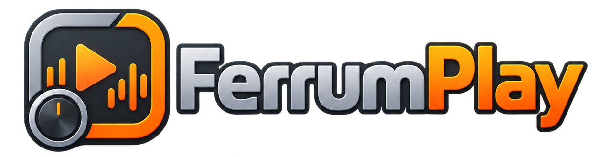
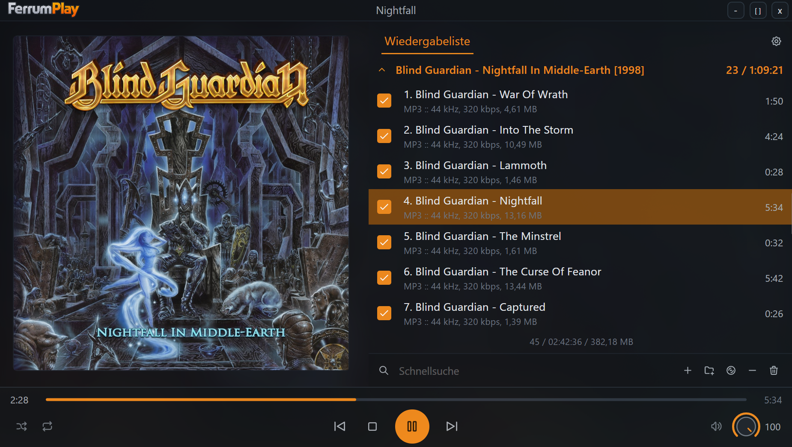
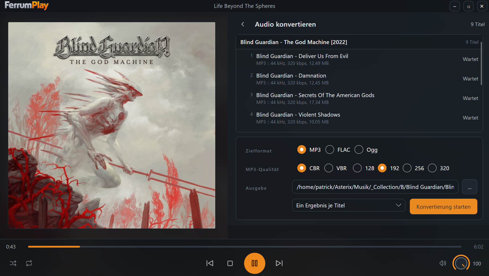

# FerrumPlay

FerrumPlay is a music player for the Linux desktop. Dark, tidy and without detours: the cover art and the details of the current track on the left, the playlist grouped by album on the right, the transport controls at the bottom. You point it at your music folders, and it plays.

It is built with [Avalonia UI](https://avaloniaui.net/) and .NET 10, in VB.NET, and plays through [libmpv](https://mpv.io/). Like its sibling [FerrumPix](https://github.com/Bitpainter75/FerrumPix), it started as a private project - an application built exactly the way I wanted one to look and work - and it is free and open source for anyone who finds it useful.

To be transparent: yes, I use AI to support my development workflow. It still takes a lot of manual work, planning and debugging, and a lot of care went into the details.

## Why FerrumPlay?

I wanted a player in the spirit of the classic desktop players: one window, a real playlist, the album in front of you - no streaming service, no library database to maintain, no account. Files and folders go in, music comes out, and everything stays on your own machine.

FerrumPlay does not import or rearrange your collection. It reads what is in the files, groups the playlist by the folders your albums already live in, and remembers where you left off.

## What it does

- **Plays what you have.** MP3, FLAC, OGG, Opus, M4A, AAC, ALAC, WAV, AIFF, WavPack, APE, WMA, Musepack, DSF and MP2.
- **Knows your tracks.** Artist, album, year, duration, sample rate and bitrate are read from the file's tags. The cover comes from the track itself or from an image in its folder.
- **Groups by album.** Every folder becomes a group with a header, track count and total running time. Groups can be collapsed.
- **Finds quickly.** The quick search filters by title, artist, album and file name.
- **Takes what you give it.** Drag files and whole folders into the window, add them with the buttons below the list, or pass them on the command line.
- **Shuffle and repeat.** Whole list or a single track. Don't want to hear a track right now? Untick it instead of removing it.
- **Gapless.** A continuously mixed album plays from track to track without a break.
- **Plays Audio CDs.** On Linux, an inserted Audio CD is detected automatically and appears as a
  separate temporary playlist. Its tracks can be selected, searched and played just like files;
  ejecting the disc removes the playlist again.
- **Browses Lyrion.** Connect a Lyrion Media Server to search its albums as you type, view server
  artwork, and play an album locally through FerrumPlay. The album becomes a temporary playlist,
  including next/previous, shuffle, repeat, and jump-to-current-track.
- **Edits MP3 albums.** Update shared album metadata and per-track titles or numbers, replace the
  embedded cover, clean up tags, and keep useful defaults for recurring album work.
- **Converts without another app.** Convert a title or album to MP3 (CBR or VBR), FLAC or Ogg
  Vorbis. Whole selections or individual source folders can become one ordered file, with a live
  queue that follows the title currently being converted.
- **Evens out loudness.** ReplayGain by track, by album, or automatically: by album while an album plays through, by track when shuffling.
- **Notices missing files.** Tracks whose file is gone are greyed out and skipped instead of stopping playback. Plug the drive back in and they return; one click removes them all.
- **Fits into the desktop.** FerrumPlay speaks MPRIS, so Waybar, playerctl, notifications and the media keys reach it even while its window is in the background - with title, artist, album and cover.
- **Runs once.** Open a file or folder from the file manager while FerrumPlay is running, and the running window takes it over, plays it, expands its album group and scrolls directly to the requested track.
- **Remembers everything.** Playlist, volume, window position and the last track are back at the next start - and if you like, playback resumes right where it stopped.
- **Speaks your language.** German and English, following your system by default.



## The player

The window is split into three areas. The cover column on the left shows the artwork, title, artist, album and the technical details of the track; its width can be dragged. The playlist on the right lists your albums with their tracks, while an inserted Audio CD has its own tab. The track that is playing stays highlighted even when the selection is somewhere else. Behind both, the cover of the current track fills the window, softly blurred.

The transport sits on a dark deck at the bottom: the progress bar across the full width, shuffle and repeat on the left, previous, stop, play and next in the middle, and the volume on the right. The volume is a rotary knob, taken from the FerrumPlay logo - drag it up or to the right to turn it up, or use the mouse wheel or the arrow keys.



## Settings

Accent colour, font size, language, the blurred cover background, the width of the cover column,
gapless playback, volume leveling (ReplayGain) with a preamp, and resuming on start are all
configurable. The MP3 editor and Lyrion browser also keep their own defaults; entering a Lyrion
server address makes its player tab available. On Linux, the whole interface can also be scaled
per screen, for displays where it would otherwise come out too small.

## Installation

### Linux

| Package | For | Download |
|---|---|---|
| AppImage | Any distribution, runs without installing | [FerrumPlay-x86_64.AppImage](https://github.com/Bitpainter75/FerrumPlay/releases/download/latest/FerrumPlay-x86_64.AppImage) |
| ZIP | Portable, unpack and run (x64) | [Releases](https://github.com/Bitpainter75/FerrumPlay/releases/latest) |

The AppImage carries update information, so tools that manage AppImages find new versions on their own.

The packages are self-contained and bring the .NET runtime with them. **libmpv is needed** and comes from your distribution:

| Distribution | Package |
|---|---|
| Arch, CachyOS, Manjaro | `mpv` |
| Debian, Ubuntu, Mint | `libmpv2` |
| Fedora | `mpv-libs` |

Without it FerrumPlay starts, but tells you it cannot play anything. The converter additionally
uses **FFmpeg** (`ffmpeg` on Arch, Debian/Ubuntu and Fedora); Audio-CD ripping uses
**cdparanoia**. The DEB, RPM and AUR packages declare both as dependencies.

Audio CD playback uses the optical drive directly. On Linux, your account needs read access to the
drive (typically through the distribution's optical-drive permission group).

### Windows and macOS

The code is prepared for both, but there are no packages yet and they are untested. MPRIS and the single running instance need the D-Bus session bus and are Linux only. If you build it there and try it, please let me know how it goes.

## Usage

```
FerrumPlay [--debug] [file or folder ...]
```

Files and folders passed on the command line are added to the playlist, folders including their subfolders, and the first track starts playing:

```bash
FerrumPlay ~/Music/Album
FerrumPlay track.flac another.mp3
```

If FerrumPlay is already running, the running instance takes the files and folders over, plays the
first track, and scrolls the playlist to it; the new call exits right away without opening a second
window. Called without paths, it brings the running window to the front.

`--debug` writes a log for this run.

| Key | Action |
|---|---|
| SPACE | Play and pause |
| ESC | Back from the settings |
| Media keys | Play, pause, next, previous, stop - system-wide through MPRIS |

Double-click a track to play it, double-click an album header to collapse or expand the group.

Settings and the playlist are stored in `~/.config/FerrumPlay/`.

## Building from source

Requires the [.NET SDK 10](https://dotnet.microsoft.com/) or newer, and libmpv to actually hear something.

```bash
dotnet build FerrumPlay.sln
dotnet run --project FerrumPlay.vbproj
```

`packaging/package.sh` builds the AppImage and the portable ZIP.

## Licence

FerrumPlay is [GPL-3.0-only](LICENSE). Every package carries that licence text and a `THIRD-PARTY-NOTICES.txt` naming each component and the licence it is used under: .NET, Avalonia UI and SkiaSharp (MIT), Skia (BSD-3-Clause), HarfBuzz (Old MIT), [TagLib#](https://github.com/mono/taglib-sharp) (LGPL-2.1) and [Tabler Icons](https://github.com/tabler/tabler-icons) (MIT). [libmpv](https://mpv.io/) (GPL-2.0-or-later) is not bundled; it is loaded from your system.

FerrumPlay is at version 0.6.0 and in active development.
